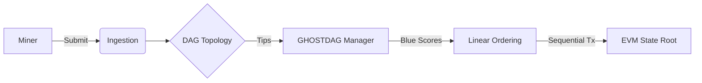

# System Architecture

DagDev provides a complete local development stack for BlockDAG applications. It mirrors the production environment of networks like Kaspa but optimized for developer feedback loops.

## High-Level Components

The system is composed of three primary layers:

1.  **DRE (Dag Runtime Environment)**: The core node logic.
2.  **CLI (Command Line Interface)**: The developer's control center.
3.  **Visualizer**: The interactive observation deck.

---

### 1. The DRE (Dag Runtime Environment)

At the heart of DagDev is a simplified, deterministic implementation of the GHOSTDAG consensus protocol.

#### The Pipeline
Blocks in DagDev flow through a strictly defined pipeline:

*   **Ingestion**: Blocks are submitted via RPC or internal miners.
*   **DAG Construction**: The block is added to the graph, referencing current tips (parents).
*   **GHOSTDAG Analysis**:
    *   The "Blue Set" is calculated using the greedy `MaxK` algorithm.
    *   Blocks are colored **Blue** (accepted) or **Red** (anticone/conflict).
*   **Ordering**: A deterministic topological sort is applied to the Blue Set to create a linear sequence.
*   **EVM Execution**: Transactions within the ordered blocks are executed against the EVM state.

---

### 2. Command Line Interface

The `dagdev` CLI handles project scaffolding, process management, and configuration.

*   **`dagdev init`**: Creates a new workspace with `hardhat.config.js` tailored for DAG support.
*   **`dagdev node`**: Spawns a local DRE instance. It binds to port `16110` (RPC) and `16210` (P2P).
*   **`dagdev mine`**: Triggers the internal CPU miner to generate blocks on demand.

### 3. The Visualizer

Because DAGs are non-linear, standard block explorers (like Etherscan) are insufficient for debugging. The DagDev Visualizer connects via WebSocket to the local node to render:

*   **Real-time Topology**: See blocks arrive and connect parents.
*   **Coloring Events**: Watch blocks flip from "Pending" to "Blue" or "Red" as consensus stabilizes.
*   **Confirmation Depth**: Visual feedback on block maturity.

    <DAGDiagram blockCount={15} />

